# omni-ml

<a target="_blank" href="https://cookiecutter-data-science.drivendata.org/">
    
</a>

<div style="display: flex;">

  <a href="https://www.youtube.com/playlist?list=PL3iMuuZjTaTJu01noBWHrLnX1ayRrzTiu" target="_blank" style="display: inline-block; margin-right: 8px;">
    
  </a>

  <a href="https://www.linkedin.com/in/moreira-and/" target="_blank" style="display: inline-block; margin-right: 8px;">
    
  </a>

  <a href="https://github1s.com/moreira-and/omni-ml/" target="_blank" style="display: inline-block;">
    
  </a>
</div>

Data Science Template from cookiecutter

```mermaid
flowchart LR
    A["«interface»<br><b>dataset</b>"] --> B["«interface»<br><b>feature</b>"]
    B --> C["«interface»<br><b>preprocess</b>"]
    C --> D["«interface»<br><b>train</b>"]
    D --> E["«interface»<br><b>evaluate</b>"]
    E --> F["«interface»<br><b>infer</b>"]
    F --> G["«interface»<br><b>explain</b>"]

    %% Estilos (cores baseadas no diagrama original)
    style A fill:#dae8fc,stroke:#6c8ebf,stroke-width:2px
    style B fill:#dae8fc,stroke:#6c8ebf,stroke-width:2px
    style C fill:#dae8fc,stroke:#6c8ebf,stroke-width:2px
    style D fill:#d5e8d4,stroke:#82b366,stroke-width:2px
    style E fill:#d5e8d4,stroke:#82b366,stroke-width:2px
    style F fill:#dae8fc,stroke:#6c8ebf,stroke-width:2px
    style G fill:#d5e8d4,stroke:#82b366,stroke-width:2px
```




## Install

```bash

poetry env use python
poetry install

```

## Project Organization

```
├── LICENSE            <- Open-source license if one is chosen
├── Makefile           <- Makefile with convenience commands like `make data` or `make train`
├── README.md          <- The top-level README for developers using this project.
├── data
│   ├── external       <- Data from third party sources.
│   ├── interim        <- Intermediate data that has been transformed.
│   ├── processed      <- The final, canonical data sets for modeling.
│   └── raw            <- The original, immutable data dump.
│
├── docs               <- A default mkdocs project; see www.mkdocs.org for details
│
├── models             <- Trained and serialized models, model predictions, or model summaries
│
├── notebooks          <- Jupyter notebooks. Naming convention is a number (for ordering),
│                         the creator's initials, and a short `-` delimited description, e.g.
│                         `1.0-jqp-initial-data-exploration`.
│
├── pyproject.toml     <- Project configuration file with package metadata for 
│                         src and configuration for tools like black
│
├── references         <- Data dictionaries, manuals, and all other explanatory materials.
│
├── reports            <- Generated analysis as HTML, PDF, LaTeX, etc.
│   └── figures        <- Generated graphics and figures to be used in reporting
│
├── requirements.txt   <- The requirements file for reproducing the analysis environment, e.g.
│                         generated with `pip freeze > requirements.txt`
│
├── setup.cfg          <- Configuration file for flake8
│
└── src   <- Source code for use in this project.
    │
    ├── __init__.py             <- Makes src a Python module
    │
    ├── config.py               <- Store useful variables and configuration
    │
    ├── dataset.py              <- Scripts to download or generate data
    │
    ├── features.py             <- Code to create features for modeling
    │
    ├── modeling                
    │   ├── __init__.py 
    │   ├── predict.py          <- Code to run model inference with trained models          
    │   └── train.py            <- Code to train models
    │
    └── plots.py                <- Code to create visualizations
```

--------

