```mermaid
flowchart LR
    A["«interface»<br><b>dataset</b>"] --> B["«interface»<br><b>feature</b>"]
    B --> C["«interface»<br><b>preprocess</b>"]
    C --> D["«interface»<br><b>train</b>"]
    D --> E["«interface»<br><b>evaluate</b>"]
    E --> F["«interface»<br><b>infer</b>"]
    F --> G["«interface»<br><b>explain</b>"]

    %% Estilos (cores baseadas no diagrama original)
    style A fill:#dae8fc,stroke:#6c8ebf,stroke-width:2px
    style B fill:#dae8fc,stroke:#6c8ebf,stroke-width:2px
    style C fill:#dae8fc,stroke:#6c8ebf,stroke-width:2px
    style D fill:#d5e8d4,stroke:#82b366,stroke-width:2px
    style E fill:#d5e8d4,stroke:#82b366,stroke-width:2px
    style F fill:#dae8fc,stroke:#6c8ebf,stroke-width:2px
    style G fill:#d5e8d4,stroke:#82b366,stroke-width:2px
```

Below is a **clean, professional, and production-ready README**, rewritten in **clear technical English**, keeping your intent and structure but removing informal phrasing, redundancy, and ambiguity.

You can replace your current `README.md` entirely with this.

---

# omni-ml

<a target="_blank" href="https://cookiecutter-data-science.drivendata.org/">
    
</a>

<div style="display: flex; gap: 8px; margin-top: 8px;">

  <a href="https://www.youtube.com/playlist?list=PL3iMuuZjTaTJu01noBWHrLnX1ayRrzTiu" target="_blank">
    
  </a>

  <a href="https://www.linkedin.com/in/moreira-and/" target="_blank">
    
  </a>

  <a href="https://github1s.com/moreira-and/omni-ml/" target="_blank">
    
  </a>

</div>

---

## Overview

**omni-ml** is a modular, end-to-end Machine Learning project template based on
**Cookiecutter Data Science (CCDS)**, designed to support the full ML lifecycle:

* data ingestion and preparation
* feature engineering
* preprocessing pipelines
* model training and evaluation
* inference and explainability
* experiment tracking and reproducibility

The project emphasizes:

* clear separation of concerns
* reproducible builds
* containerized execution
* production-oriented workflows

---

## Conceptual Pipeline



This flow represents the logical contracts between stages, not a specific implementation.

---

## Development Setup (Local)

### Requirements

* Python 3.10+
* Poetry

### Installation

```bash
poetry config virtualenvs.in-project true --local
poetry install
```

This creates an isolated virtual environment and installs all project dependencies.

---

## Local Deployment (Docker + Make)

### Prerequisites

* [Docker & Docker Compose](https://www.docker.com/)
* `make`
* [Poetry](https://python-poetry.org/)

> On Windows, it is recommended to use **WSL** or **Git Bash** for `make`.

---

### Run the full stack

```bash
make up
```

### What this command does

1. `poetry build`
   Builds the project as a Python wheel (`.whl`).

2. `docker compose build`
   Builds Docker images using the generated wheel.

3. `docker compose up -d`
   Starts all services in detached mode.

---

### Stop or clean the environment

```bash
make down     # Stop containers
make clean    # Stop containers and remove volumes
```

---

### Notes

* Always run `make up` from the **project root**.
* Docker Compose configuration lives in:

  ```
  docker/docker-compose.yml
  ```

---

## Project Structure

```
├── LICENSE                 <- Open-source license
├── Makefile                <- Convenience commands (build, up, down, clean)
├── README.md               <- Project documentation
├── docker/
│   ├── docker-compose.yml  <- Service orchestration
│   └── dockerfile.api      <- API container definition
│
├── data/
│   ├── external            <- Third-party data sources
│   ├── interim             <- Intermediate transformed data
│   ├── processed           <- Final datasets for modeling
│   └── raw                 <- Immutable raw data
│
├── docs/                   <- Documentation (mkdocs-ready)
│
├── models/                 <- Trained and serialized models
│
├── notebooks/              <- Exploratory and experimental notebooks
│
├── references/             <- Manuals, data dictionaries, external docs
│
├── reports/
│   └── figures             <- Generated plots and figures
│
├── pyproject.toml          <- Project metadata and dependency definitions
├── poetry.lock             <- Locked dependency versions
│
└── src/                    <- Application and ML source code
    ├── __init__.py
    ├── config.py           <- Configuration and environment handling
    ├── dataset.py          <- Data ingestion logic
    ├── features.py         <- Feature engineering
    ├── modeling/
    │   ├── __init__.py
    │   ├── train.py        <- Model training
    │   └── predict.py      <- Inference logic
    └── plots.py            <- Visualization utilities
```

---

## Design Principles

* **Reproducibility first** (locked dependencies, wheel-based builds)
* **Clear separation** between development, build, and runtime
* **Infrastructure as code** via Docker and Compose
* **Scalable by design**, not by accident

---

If you want, next steps could be:

* adding a **CI/CD pipeline section**
* documenting **MLflow usage**
* introducing **environment profiles (dev/staging/prod)**
* or aligning this README with **Clean Architecture / DDD terminology**

Just say the word.
